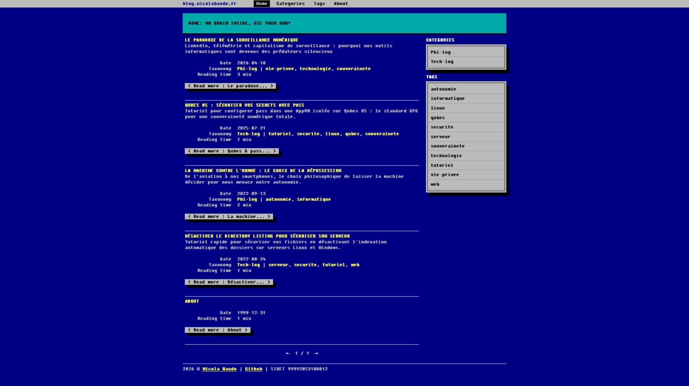
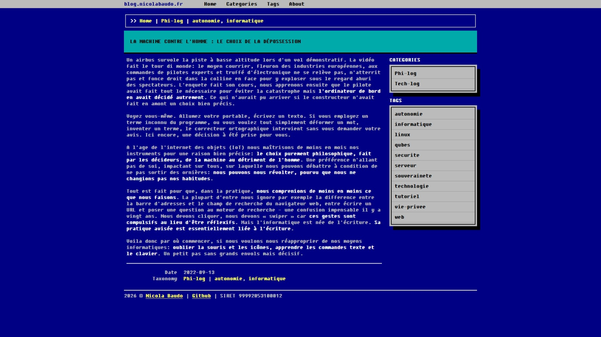
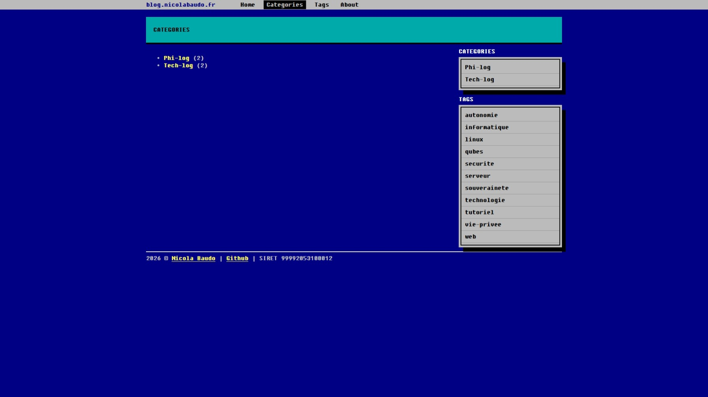
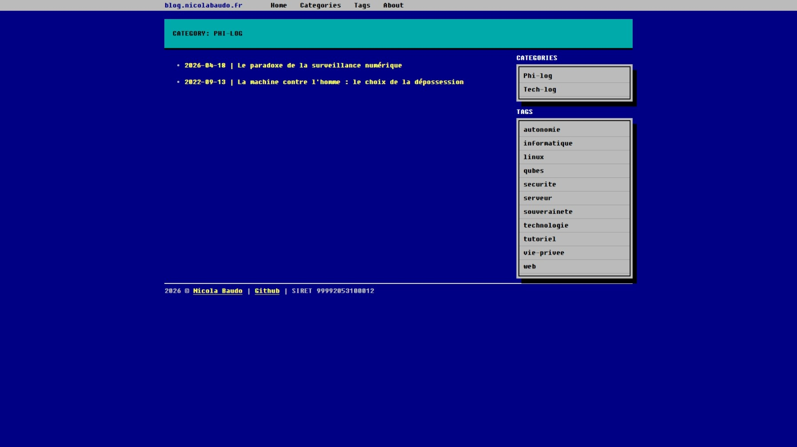
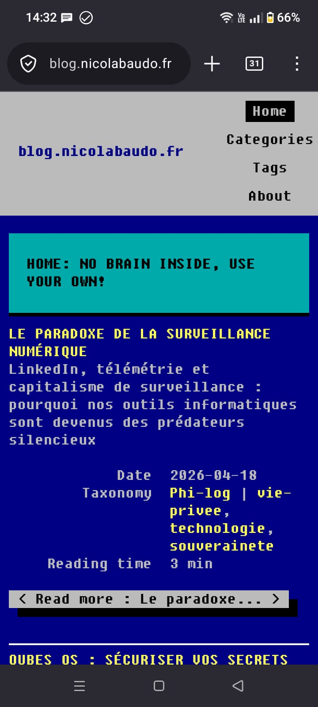
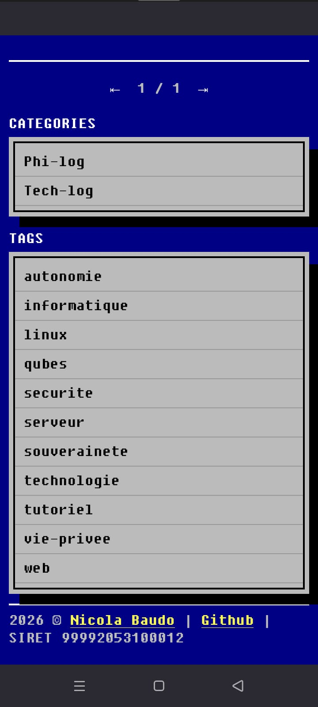
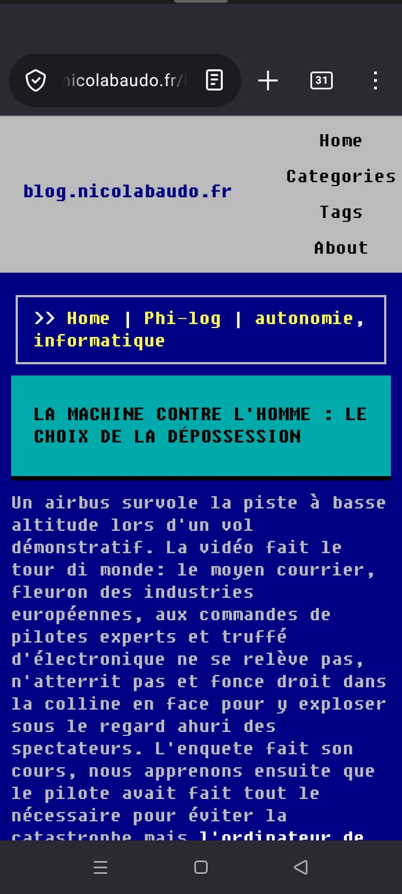

# Zola-386-nojs

`zola-386-nojs` is a lightweight, ultra-fast Zola theme inspired by the 1980s DOS/BIOS character user interface (CUI) aesthetics. It is designed for those who appreciate old-school design without compromising on modern performance and privacy.










## 🧬 Origins & Philosophy
This theme is an independent evolution of the original [zola.386](https://github.com/lopes/zola.386) theme by [José Lopes](https://github.com/lopes).

While the original port brought the DOS aesthetic to Zola, `zola-386-nojs` focuses on a **"Pure HTML/CSS"** approach:
* **No-JS:** All JavaScript dependencies have been removed, ensuring maximum speed, security, and accessibility.
* **Refactored:** The codebase has been streamlined for better maintainability.

It stands on the shoulders of giants that inspired the original design:
- [BOOTSTRA.386](https://kristopolous.github.io/BOOTSTRA.386/): Design and core ideas.
- [HUGO.386](https://themes.gohugo.io/hugo.386/): Item placement.
- [Dinkleberg](https://github.com/rust-br/dinkleberg): Internal structure and SEO.
- [after-dark](https://github.com/getzola/after-dark): Navbar and components.

## 🖥️ Features
* **DOS Aesthetics:** 16-color palette, Fixedsys font, and rigorous CUI layout.
* **Zero JavaScript:** Highly secure, privacy-focused, and incredibly fast.
* **Responsive:** Fluid layout that adapts to widescreen monitors while maintaining its retro soul.
* **Built-in Breadcrumbs:** Native navigation for a professional, OS-like feel.

## 🚀 Installation

#### As a Submodule (Recommended)
From the root of your Zola site, run:
```bash
git submodule add https://github.com/nobraininside/zola-386-nojs.git themes/zola-386-nojs
```

##### Configuration
In your `config.toml`, set the theme:
```toml
theme = "zola-386-nojs"
```

Set homepage's header content:
```toml
title = "YOUR_WEBSITE'S_NAME_OR_URL"
description = "YOUR_MOTTO"
```

Set also your footer's content:
```toml
[extra]
year = "2026"
author = "YOUR_NAME"
author_url = "YOUR_PERSONAL_WEBSITE'S_URL"
social = "YOUR PREFERRED_SOCIAL"
social_url = "YOUR_PERSONAL_SOCIAL'S_PAGE_URL"
vat = "YOUR_VAT_NR"
```
#### Daily use

Never forget [extra] field (which will appear inside read more button) and date in post's/pages' frontmatter. Here is an example:

```toml
+++
title = "Very very very very very looong title"
description = "This description will appear under the title in homepage's posts list"
template = "page.html"
date = 2025-07-21
slug  = "qubes-os-securiser-vos-secrets-avec-pass"

[extra]
short_title = "Short title"

[taxonomies]
categories = ["Tech-log"]
tags = ["tutoriel", "securite", "linux", "qubes", "souverainete"]
+++
```

🛠 Customization
The theme uses SASS variables located in sass/_theme.scss. To customize colors or font sizes, you can create a sass/custom.scss file in your main site directory and override the defaults.

📜 License
This project is released under the MIT License. See the LICENSE file for details.
